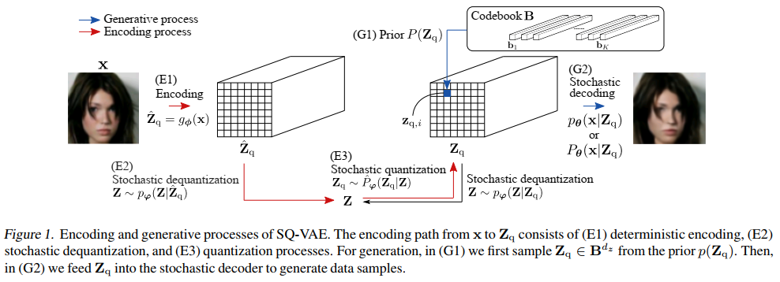

# SQ-VAE
This repository contains the official PyTorch implementation of **"SQ-VAE: Variational Bayes on Discrete Representation with Self-annealed Stochastic Quantization"** presented in ICML2022 (*[arXiv 2205.075472](https://arxiv.org/abs/2205.075472)*).
The use of this repository is RESTRICTED to non-commercial research.
Please cite [[1](#citation)] in your work when using this code in your experiments.



> **Abstract:** One noted issue of vector-quantized variational autoencoder (VQ-VAE) is that the learned discrete representation uses only a fraction of the full capacity of the codebook, also known as codebook collapse. We hypothesize that the training scheme of VQ-VAE, which involves some carefully designed heuristics, underlies this issue. In this paper, we propose a new training scheme that extends the standard VAE via novel stochastic dequantization and quantization, called stochastically quantized variational autoencoder (SQ-VAE). In SQ-VAE, we observe a trend that the quantization is stochastic at the initial stage of the training but gradually converges toward a deterministic quantization, which we call self-annealing. Our experiments show that SQ-VAE improves codebook utilization without using common heuristics. Furthermore, we empirically show that SQ-VAE is superior to VAE and VQ-VAE in vision- and speech-related tasks.


# Citation
[1] Takida, Y., Shibuya, T., Liao, W., Lai, C., Ohmura, J., Uesaka, T., Murata, N., Takahashi S., Kumakura, T. and Mitsufuji, Y.,
"SQ-VAE: Variational Bayes on Discrete Representation with Self-annealed Stochastic Quantization,"
39th International Conference on Machine Learning.
```
@INPROCEEDINGS{takida2022sq-vae,
    author={Takida, Yuhta and Shibuya, Takashi and Liao, WeiHsiang and Lai, Chieh-Hsin and Ohmura, Junki and Uesaka, Toshimitsu and Murata, Naoki and Takahashi, Shusuke and Kumakura, Toshiyuki and Mitsufuji, Yuki},
    title={{SQ-VAE}: Variational Bayes on Discrete Representation with Self-annealed Stochastic Quantization},
    booktitle={International Conference on Machine Learning},
    year={2022},
    }
```